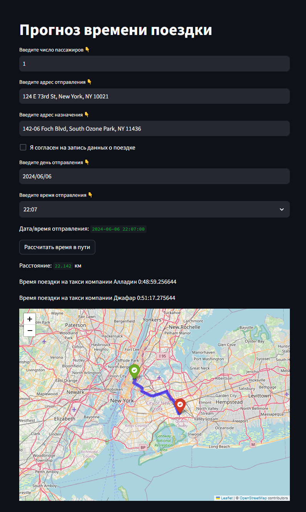

# EN
[![RU]](/README.ru.md)

# PP_Team28_Taxi_Trip_Duration
New York City Taxi Trip Duration

Notebook - [https://colab.research.google.com/drive/1jhrpfiry05yejlx5Son6_FCp7hOg14C9](https://drive.google.com/file/d/1xkbbIlnGuLnsaYvB7EOoYw0h61ncHI2P/view?usp=sharing)

Datasets - https://drive.google.com/drive/folders/138kkMzfiWiK8GPJthHCY7gIbGCXTfgYn

## The purpose of the project
The purpose of the project is to predict a numerical feature – the time of a taxi ride in New York City.
Task: building a machine learning model based on customer data to predict a numerical feature – the time of a taxi ride.

## Stages:
1) The formation of a data set based on several sources of information.
    The source data is a set of records of yellow taxi rides in New York for 2016.
    Additionally, in order to increase the accuracy of the prediction, data on: 
    * holidays in the USA;
    * the weather in New York for the specified period;
    *  travel routes (taking into account the distance and the average time spent on such a route without taking into account traffic) obtained through the OSRM service.

    Based on the signs from these sources, new additional signs were additionally formed.
    The target feature in the construction of the model is the duration of the trip. For the convenience of further calculations, this feature was logarithmic.
2) Research of the provided data and identification of patterns.
    At this stage, the analysis of the interrelationships of the features and the target variable is performed. For the convenience of the analysis, various graphs and histograms have been constructed. 
3) Designing new features using Feature Engineering and identifying the most significant ones when building a model.
    According to the results of the analysis, the transformation and screening of signs were performed. The result of this stage was a reduction in the number of signs to 25
4) Building several models and choosing the one that shows the best result for a given metric.
    At this stage, the following models were developed and showed the result:
    * the RMSlE linear regression model on training and test samples 0.53 0.54, respectively;
    * model of polynomial regression of the 2nd degree - 0.47 and 0.61;
    * polynomial regression of the 2nd degree with L2 regularization (Tikhonov regularization) - 0.48 0.48;
    * decision tree model - 0.00 and 0.57; 
    * for the decision tree model, an additional search was performed for the optimal depth value ( =11) RMSlE = 0.41 and 0.43;
    * the random forest model - 0.39 and 0.41;
    * gradient boosting model over decision trees - 0.37 0.39;
5) As a bonus, the training was performed using the extreme gradient boosting model. RMSlE in the training and test samples for this model = 0.38 and 0.39, respectively.


As a conclusion, it can be said that the models of gradient boosting over decision trees and extreme gradient boosting showed the greatest accuracy.

In addition, a prototype application based on fastapi and streamlit was developed.
The model of gradient boosting over decision trees is chosen as a model for prediction.

## Launching the application:

After downloading the source files in the project directory:
1) Preparing the environment 
````bash
# Creating a virtual environment
python -m venv env

# Activating the virtual environment in Linux
source env/bin/activate

# Activating the virtual environment in Windows
env\Scripts\activate.bat

# Installing libraries
pip install -r requirements.txt

# Installing local packages
pip install -e .
````
2) Download and convert the source data:

````bash
python .app/ml/download_dataset.py
python .app/ml/data_preprocessing.py
````
3) We train the model:

````bash
python .app/ml/model_preparation.py
````
The model is trained and ready for use.

4) Go to the application directory
````bash
cd app
````

Launching the unicorn server:  

````bash
uvicorn app.main:app
````
This server is available at 127.0.0.1:8000 
Processes post requests for http://127.0.0.1:8000/predict the following structure:

````
    passenger_count: int # number of passengers
    departure_address: str # departure address
    destination_address: str # destination address
    store_and_fwd_flag: int # mark whether to save trip data
    date: str # date and time of departure
````
The response contains:

````
    'result': list # ravel time forecast in seconds for two taxi companies
    'route': list # the intended route in the form of a list with coordinates of intermediate points
    'start_point': list # oordinate of the starting point of the proposed route
    'end_point': list  # координата конечной точки предполагаемого маршрута
    'total_distance': float # distance along the intended route
````
5) Launch the streamlet server implementing the web interface 

````bash
streamlit run appst.pyp
````


## Services used in the application
The following services were used to obtain additional time prediction features:

* * Meteostar Developers - to get weather data at the current time and in the past;
* GeoPy - geocoding service;
* ArcGIS — a complex of geoinformation software products of the American company ESRI;
* project-osrm.org - the service implements the construction of paths based on road networks

## Team:
1) Ilyin V.B. (https://github.com/Viktor-125142) – building machine learning models based on the linear regression method and the decision tree method.
2) Kravtsov A.V. (https://github.com/Baddogel) – basic analysis of the source data.
3) Efimovich E.A. (https://github.com/johnneon) – elaboration of new features.
4) Kryuchkov V.V. (https://github.com/Tifles) – selection and transformation of characters.
5) Chashnikov S.Yu. (https://github.com/SergeyChashnikov) – exploratory data analysis (EDA).
6) Salov A.S. (https://github.com/TonyStranger404)- building a machine learning model based on the ensemble method and building a final forecast.
