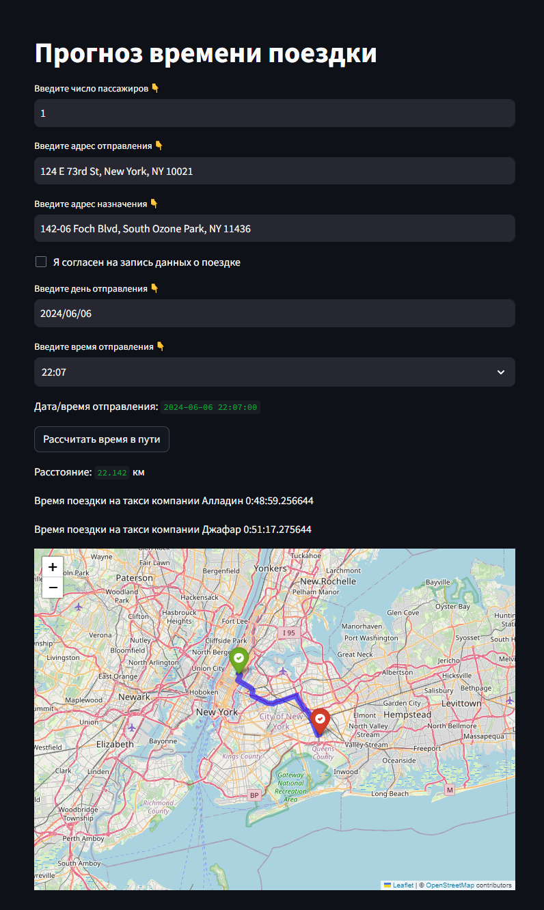

# RU

[![EN]](/README.md)

# PP_Team28_Taxi_Trip_Duration
Продолжительность поездки на такси по Нью-Йорку

Notebook - [https://colab.research.google.com/drive/1jhrpfiry05yejlx5Son6_FCp7hOg14C9](https://drive.google.com/file/d/1xkbbIlnGuLnsaYvB7EOoYw0h61ncHI2P/view?usp=sharing)

Datasets - https://drive.google.com/drive/folders/138kkMzfiWiK8GPJthHCY7gIbGCXTfgYn

## Цель проекта
Цель проекта: предсказание числового признака – времени поездки на такси в городе Нью-Йорк.
Задача: построение на основе данных заказчика модели машинного обучения для предсказывания числового признака – времени поездки на такси.
## Этапы:
1)	Формирование набора данных на основе нескольких источников информации.
    В качестве исходны данных выступает набор записей о поездках на жёлтом такси в Нью Йорке за 2016 год.
    Дополнительно, с ццелью увеличения точности предсказания, используются данные о: 
    * праздничных днях в США;
    * погоде в Нью Йорке за указанный период;
    * маршруты поездок (с учётом дистанции исреднего времени затрачиваемого на подобный маршрут без учёта трафика) полученные через сервис OSRM.

    На основании признаков из этих источников были дополнительно сформированны новые доплднительные признаки.
    Целевым признаком при построении модели выступает длительность поездки. Для удобства дальнейших вычислений данный признак был логарифмирован.
2)	Исследование предоставленных данных и выявление закономерностей.
    На данном этапе выполнен анализ взаимосвязей признаков и целевой переменной. Для удобства анализа выполнено построение различных графиков и гистограмм.
3)	Проектирование новых признаки с помощью Feature Engineering и выявление наиболее значимых при построении модели.
    По результатам анализа было выполнено преобразование и отсеивание признаков. Итогом данного этапа стало сокращение числа признаков до 25 
4)	Построение нескольких моделей и выбор из них той, которая показывает наилучший результат по заданной метрике.
    На данном этапе были и показали результат следующие модели:
    * модель линейной регрессии RMSlE на тренировочной и тестовой выборках 0.53 0.54 соответвенно;
    * модель полиномиальной регрессии 2-ой - 0.47 и 0.61;
    * полиномиальной регрессии 2-ой степени с L2-регуляризацией (регуляризация по Тихонову) - 0.48 0.48;
    * модель дерева решений - 0.00 и 0.57; 
    * для модели дерева решений дополнительно выполнен поиск оптимального значения глубины ( =11) RMSlE = 0.41 и 0.43;
    * модель случайного леса - 0.39 и 0.41;
    * модель градиентного бустинга над деревьями решений - 0.37 0.39;
5) В качестве бонуса - выполнено обучение моделью экстремального градиентного бустинга. RMSlE на тренировочной и тестовой выборках для данной модели = 0.38 и 0.39 соответвенно.


Как вывод можно сказать, что наибольшую точность показали модели градиентного бустинга над деревьями решений и экстремального градиентного бустинга.

В дополнение был разработан прототип приложения на основе fastapi и streamlit.
В качестве модели для предсказания выбрана модель градиентного бустинга над деревьями решений.

## Запуск приложения:

После загрузки исходных файлов в диерктории проекта:
1) Подготавливаем среду 
````bash
# Создание виртуального окружения
python -m venv env

# Активация виртуального окружения в Linux
source env/bin/activate

# Активация виртуального окружения в Windows
env\Scripts\activate.bat

# Устанавливаем библиотеки
pip install -r requirements.txt

# Устанавливаем локальные пакеты
pip install -e .
````
2) Загружаем и преобразуем исходные данные:

````bash
python .app/ml/download_dataset.py
python .app/ml/data_preprocessing.py
````
3)  Обучаем модель:

````bash
python .app/ml/model_preparation.py
````
Модель обучена и готова к использованию.

4) Переходим в каталог приложения
````bash
cd app
````

Запускаем uvicorn сервер:  

````bash
uvicorn app.main:app
````
Данный сервер доступен по адресу 127.0.0.1:8000 
Обрабатывает post запросы на http://127.0.0.1:8000/predict следующей структуры:

````
    passenger_count: int # число пассажиров
    departure_address: str # адрес отправления
    destination_address: str # адрес назначения
    store_and_fwd_flag: int # отметка о том - сохранять ли данные о поедке
    date: str # дата и время отправления
````
Ответ содержит:

````
    'result': list # прогноз времени поездки в секундах для двух таксопарков
    'route': list # предполагаемый маршрут в виде списка с координатами промежуточных точек
    'start_point': list # координата начальной точки предполагаемого маршрута
    'end_point': list  # координата конечной точки предполагаемого маршрута
    'total_distance': float # расстояние по предполагаемому маршруту
````
5) Запускаем streamlit сервер реализующий web-интерфейс 

````bash
streamlit run appst.pyp
````



## Сервисы используемые в приложении
Для получения дополнительных признаков для предсказания времени использовались следующие сервисы:

* Meteostat Developers - для получения данных о погоде в текущий момент времени и в прошлом;
* GeoPy - сервис геокодирования;
* ArcGIS — комплекс геоинформационных программных продуктов американской компании ESRI;
* project-osrm.org - сервис реализует построение путей на основе дорожных сетей

##  Команда
1)	Ильин В.Б. (https://github.com/Viktor-125142) – построение моделей машинного обучения на основе метода линейной регрессии и метода деревьев решения.
2)	Кравцов А.В. (https://github.com/Baddogel) – базовый анализ исходных данных.
3)	Ефимович Е.А. (https://github.com/johnneon) – проработка новых признаков.
4)	Крючков В.В. (https://github.com/Tifles) – отбор и преобразование признаков.
5)	Чашников С.Ю. (https://github.com/SergeyChashnikov) – разведывательный анализ данных (EDA).
6)	Салов А.С. (https://github.com/TonyStranger404) - построение модели машинного обучения на основе ансамблевого метода и построение итогового прогноза.
